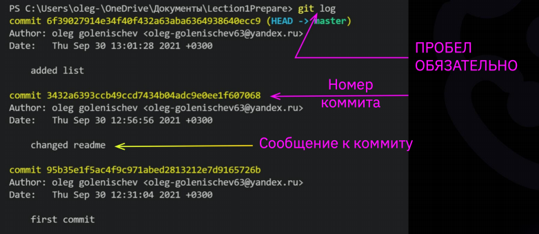
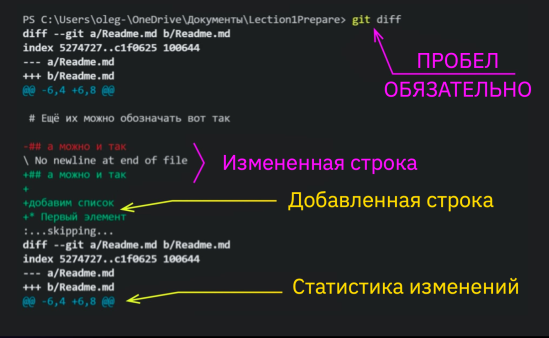

# Соответствие групп и тем на практикум.
1. Что такое система контроля версий
2. Для чего нужна система контроля версий
3. Установка git на ваш ПК (в зависимости от системы)
4. Установка VSCode на ваш ПК
5. Что такое репозиторий и инструкция по созданию локальных репозиториев.
6. Базовая работа с локальным репозиторием
* Команда git init
Инициализация: указываем папку, в которой git начнёт отслеживать изменения
В папке создаётся скрытая папка .git

* Команда git status
Показывает текущее состояние гита, есть ли изменения, которые нужно закоммитить(сохранить)
Чтобы вызвать ранее введённую команду, пользуемся стрелками на клавиатуре. Перебираем недавно введённые команды нажатием стрелки «вверх»
* Команда git add
добавляет содержимое рабочего каталога в индекс (staging area) для последующего коммита. Эта команда дается после добавления файлов. Писать название целиком не обязательно: терминал дозаполнит данные автоматически.

* Команда git commit
зафиксировать или сохранить
По умолчанию git commit использует лишь этот индекс, так что вы можете использовать git add  для сборки слепка вашего следующего коммита. Команда git commit берёт все данные, добавленные в индекс с помощью git add, и сохраняет их слепок во внутренней базе данных, а затем сдвигает указатель текущей ветки на этот слепок.

* Команда git log 
Журнал изменений
Перед переключением версии файла в Git используйте команду git log, чтобы увидеть количество сохранений

* Команда git checkout
Переключение между версиями.
Для работы нужно указать не только интересующий вас коммит, но и вернуться в тот, где работаем, при помощи команды git checkout master.
Нажатие клавиши ‘q’ возвращает в исходное окно терминала.
* Команда git diff
Показывает разницу между текущим файлом и сохранённым
Перед переключением версии файла в Git используйте команду git log, чтобы увидеть количество сохранений

* Синтаксис языка Markdown.
Жирный текст — ** или __
Курсивный текст — * или _
Зачеркнутый текст — ~
Выделяют заголовки — # в начале строк
Показать уровень заголовка — подчеркивание знаками =или ****
Нумерованные Списки — обозначаются обычными цифрами 1, 2, 3
Ненумерованные Списки — обозначаются *знаками в начале строки
Вложенные Списки — выполняем отступы
* git branch
Если у нас несколько версий черновика, мы можем вывести на экран ветку, где находимся, командой git branch.
Создать ветку можно командой git branch. Делать это надо в папке с репозиторием:
git branch <название новой ветки>

* git merge
Чтобы слить любую ветку с текущей, вызываем git merge <имя ветки для слияния с текущей>

* git log –graph
Команда -graf в связке с командой log позволяет отобразить коммиты в виде дерева.

7. Что такое ветки и для чего они нужны при работе с системой контроля версий.
8. Базовая работа с ветками в git.
9. Что такое удаленный репозиторий и для чего он нужен
10. Базовая работа с удаленными репозиториями GitHub
11. Как строится и для чего нужна совместная работа в системах контроля версий
12. Инструкция по созданию pull request
13. Книги и полезные ссылки по изучению git.
14. Альтернативные системы контроля версий.